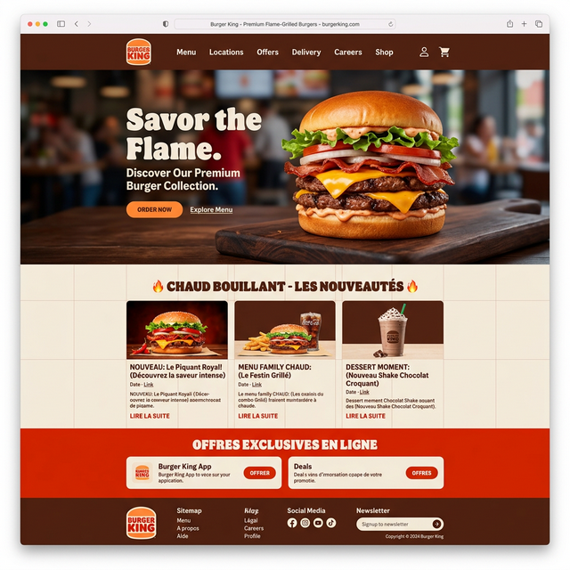

# 🍔 Burger King - Premium Web Redesign



# Burger King Redesign Project 🍔👑


## À propos du projet

Ce projet est une version remasterisée et premium d'une landing page Burger King. L'objectif initial était de corriger les chemins d'images et les fautes de frappe, mais le projet a évolué vers une refonte complète de l'interface utilisateur (UI) pour offrir une expérience plus moderne, immersive et visuellement attrayante. 

Le design a été peaufiné pour correspondre exactement à une maquette conceptuelle ("Premium Flame-Grilled Burgers"), en utilisant des polices audacieuses, une palette de couleurs stricte et une mise en page soignée.

## ✨ Fonctionnalités & Améliorations

*   **Design Premium & Fidèle à la Maquette :**
    *   Interface entièrement repensée avec une esthétique premium.
    *   Header moderne avec navigation claire et actions utilisateur.
    *   Section Hero percutante mettant en valeur les produits phares.
    *   Cartes d'actualités ("CHAUD BOUILLANT") restructurées avec un affichage optimal des images.
    *   Bandeau d'offres promotionnelles rouge vif, typique de la marque.
    *   Footer complet et professionnel avec inscription à la newsletter.
*   **CSS Personnalisé (Zéro Bootstrap) :** 
    *   Suppression de Bootstrap pour éviter les conflits de style et garantir un contrôle total au pixel près.
    *   Utilisation intensive de CSS Flexbox pour un alignement et une structure parfaits.
    *   Variables CSS (Custom Properties) utilisées pour maintenir la cohérence de la palette de couleurs.
*   **Responsive Design Complet :** Le site s'adapte parfaitement aux mobiles, tablettes et écrans de bureau grâce à des media queries spécifiques.
*   **Corrections Initiales (Bug Fixes) :** 
    *   Tous les liens d'images cassés (`images/...`) ont été corrigés.
    *   Les diverses fautes d'orthographe et de grammaire présentes dans la version originale ont été rectifiées.

## 🛠️ Technologies Utilisées

*   **HTML5** : Structure sémantique repensée.
*   **CSS3** : Flexbox, Grid, Media Queries, Hover Effects, Transitions.
*   **Google Fonts** : Utilisation des polices 'Anton' (titres) et 'Inter' (texte).
*   **Font Awesome** : Pour les icônes (utilisateur, panier, réseaux sociaux).
*   **Git & GitHub** : Gestion de version du projet.

## 📁 Structure des Fichiers

*   `hum.html` : Fichier principal de la structure (Landing Page).
*   `hum.css` : Feuille de style unique et exhaustive pour le design premium.
*   `images/` : Dossier contenant tous les assets (logos, images de burgers, etc.).
*   `README.md` : Documentation actuelle du projet.

## 🚀 Comment l'utiliser

1.  Clonez ce dépôt sur votre machine locale :
    ```bash
    git clone https://github.com/charaf12-u/BURGER-KING-web.git
    ```
2.  Accédez au dossier du projet :
    ```bash
    cd BURGER-KING-web
    ```
3.  Ouvrez le fichier `hum.html` dans votre navigateur web préféré. Aucune installation de dépendance n'est requise.

---
*Projet réalisé à des fins d'apprentissage et de démonstration technique.*
